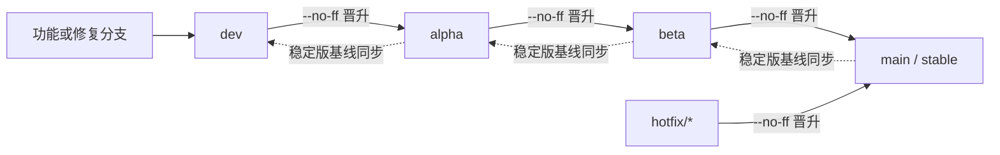

# xOyz Minecraft Launcher 发布模型

<!-- #BEGIN LANGUAGE_SWITCHER -->
**中文** (**简体**, [繁體](ReleaseSchedule_zh_Hant.md)) | [English](ReleaseSchedule_en.md)
<!-- #END LANGUAGE_SWITCHER -->

本文定义从 `1.0.0` 开始使用的 XYML 发布模型。

## 适用范围与历史

- `1.0.0` 是新模型下的第一个稳定版。
- 历史开发快照、标签和更新日志继续保留其原有发布模型与版本含义，不重命名，也不按新模型重新解释。
- 尚未公开发布的 `3.17.0` 稳定测试版本仅有一个严格受限的迁移例外：它可以把 `1.0.0` 稳定版识别为更新。这不是通用的版本代际或自动兼容器，也不表示允许其他 `3.x -> 1.x` 更新。
- 每段版本号都使用十进制，不使用十六进制、Base64 或其他进制。

## 版本格式

十进制数字的段数表示发布渠道。

| 渠道 | 格式 | 示例 | 测试人群 |
| --- | --- | --- | --- |
| 稳定版（Stable） | `x.y.z` | `1.0.0` | 普通用户 |
| 公测版（Beta） | `x.y.z.b` | `1.0.0.1` | 不特定、自愿参与且不预先审核的用户 |
| 内测版（Alpha） | `x.y.z.b.a` | `1.0.0.0.1` | 选定的小范围测试用户 |
| 开发版（Dev） | `x.y.z.b.a.d` | `1.0.0.0.0.1` | 开发者和早期验证人员 |

前三段表示稳定版本的变更规模：

- `x` 变化表示大型架构重构。
- `x.y` 变化表示功能更新。
- `x.y.z` 变化表示 Bug 修复或微调。

额外的 `b`、`a` 和 `d` 分别表示基于该稳定版本线的公测、内测和开发候选计数。每次晋升都要为目标渠道选择新版本号，不能仅删除末尾数字就把候选版本当作更稳定版本。

### 排序与晋升

只要在晋升时正确推进目标计数，十进制比较就能保持时间顺序。一次常规补丁候选可以按以下顺序演进：

```text
1.0.0 < 1.0.0.0.0.1 < 1.0.0.0.1 < 1.0.0.1 < 1.0.1
稳定版      开发版          内测版        公测版       稳定版
```

例如，公测版 `3.17.0.1` 通常并入稳定版 `3.17.1`，而不是稳定版 `3.17.0`。如果紧急修订已先把稳定版推进到 `3.17.1`，该候选内容可能直到稳定版 `3.17.2` 才首次合入。公测版实际晋升时，应根据其变更内容和当时的稳定版本共同决定新的稳定版本号。

将公测版晋升到 `main` 或发布稳定版 Hotfix 的补丁，必须同时把 `config/project.properties` 中的 `stableVersion` 更新为选定的稳定版本。后续按 `main -> beta -> alpha -> dev` 同步时，必须把这一稳定基线带到所有发布分支。

## 分支模型

| 分支 | 渠道 | 职责 |
| --- | --- | --- |
| `main` | 稳定版 | 面向普通用户的发布与紧急修订 |
| `beta` | 公测版 | 由不特定的自愿用户公开测试 |
| `alpha` | 内测版 | 由选定的小范围用户测试 |
| `dev` | 开发版 | 功能和修复的默认集成分支 |

GitHub 默认分支应设为 `dev`。功能分支和修复分支从 `dev` 创建，完成针对性开发与测试后合并回 `dev`。功能或修复分支不能作为发布渠道的源分支。



所有向更稳定渠道的合并都必须使用 `git merge --no-ff`，包括 `hotfix/* -> main`。只有稳定版晋升或紧急修订改变稳定版基线后，发布分支才可以向较低稳定度渠道同步，并且必须逐级进行：`main -> beta -> alpha -> dev`。每一步都必须直接使用上一渠道的对应基线载体，即 `main` 上的稳定版发布或紧急修订合并，以及其后的每个同步合并；不能在这条反向链中夹入普通提交。普通的 `alpha -> dev` 或 `beta -> alpha` 同步不是版本纪元边界，也不属于正常流程。共享发布分支不得 rebase 或强制推送。

发布策略工作流会在合并前检查准确的目标提交、来源提交和完整稳定版基线链，并在合并后审计发布合并。合并后审计要求合并结果从第二父提交取得 `stableVersion`。仓库规则还必须允许发布 PR 使用合并提交；合并后审计仍会发现绕过该要求的 squash 或 rebase 合并。

## 分发与反馈

更新频率从稳定版、公测版、内测版到开发版依次升高。

| 渠道 | Github Release | 官网 | 反馈入口 |
| --- | --- | --- | --- |
| 稳定版 | 发布 | 发布 | 公开 |
| 公测版 | 不发布 | 发布 | 公开 |
| 内测版 | 不发布 | 不发布 | 受限测试计划 |
| 开发版 | 不发布 | 不发布 | 受限测试计划 |

Github Release 只发布稳定版，官网发布稳定版和公测版。内测版和开发版不公开分发，只通过受限测试计划收集反馈。公开 Bug 表单只接受当前稳定版和公测版的问题。

## 构建与发布

构建接受以下发布输入：

- `RELEASE_CHANNEL`：必须是 `stable`、`beta`、`alpha` 或 `dev`。
- `RELEASE_VERSION`：晋升时使用的完整十进制版本号。
- `BUILD_NUMBER`：未指定 `RELEASE_VERSION` 时，普通 CI 构建使用的最后一段正十进制数字。
- `STABLE_VERSION`：可选，用于覆盖 `config/project.properties` 中的 `stableVersion`。

根 Gradle 构建中 `stl` 分类下的任务会根据 Git 拓扑推断版本号。公测版、内测版和开发版组成分层版本纪元。渠道晋升会快照源渠道的完整前缀，并把目标渠道及所有更低稳定度渠道的计数清零；稳定版基线通过明确的相邻同步链 `main -> beta -> alpha -> dev` 传递。
因此，新公测版 `x.y.z.b` 会让内测版变为 `x.y.z.b.0`、开发版变为 `x.y.z.b.0.0`；新内测版 `x.y.z.b.a` 会让开发版变为 `x.y.z.b.a.0`。
较低稳定度分支不需要从已晋升渠道反向合并；其在晋升之后产生的第一个提交会继承新前缀。`buildMain`、`buildBeta`、`buildAlpha` 和 `buildDev` 会把该推断版本注入隔离构建。无法识别晋升边界之前的历史继续使用旧的合并基点算法，不会被重新编号。

以开发版选择性晋升为例：假设提交 A 是 `1.0.0.0.0.0`，紧随其后的 B 是 `1.0.0.0.0.1`。把 A 合并到内测版后得到 `1.0.0.0.1`。B 仍为 `1.0.0.0.0.1`，其后的第一个开发版提交 C（时间晚于该内测版晋升）从新纪元 `1.0.0.0.1.0` 开始。

功能分支、修复分支、hotfix 分支和游离提交使用其可达发布分支基点对应的完整渠道版本，并在末尾追加 `.`。解析时按 `dev > alpha > beta > main` 的渠道优先级选择最靠近 Dev 的候选，再从同一渠道可达的合入点和起始点中选择拓扑顺序最晚者。基点可以是 `main` 的三段版本、`beta` 的四段版本、`alpha` 的五段版本或 `dev` 的六段版本；例如 Dev 基点 `1.0.4.1.0.6` 对应功能版本 `1.0.4.1.0.6.`。功能分支自身的提交以及未提交改动不会改变该版本。如果找不到任何发布分支基点，则固定使用 `0.0.0.0.0.0.`。`main`、`beta`、`alpha` 和 `dev` 作为正式发布分支时仍使用无尾随点的渠道格式。带尾随点版本仍属于 `dev` 构建渠道，用于禁止自动更新；产物文件名将末尾 `.` 替换为 `-`，例如 `XYML-1.0.4.1.0.6-.jar`。

Github Release 发布工作流只能从 `main` 运行，只创建稳定版 Release 并更新稳定版升级描述文件，不发布公测版、内测版或开发版。官网分发按上表执行。
