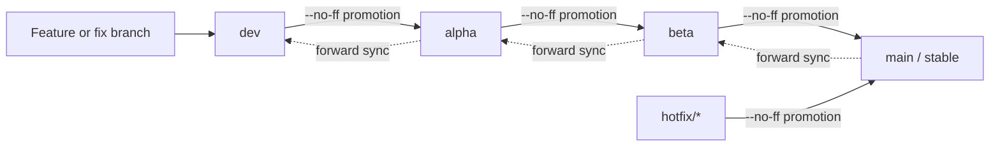

# xOyz Minecraft Launcher Release Model

<!-- #BEGIN LANGUAGE_SWITCHER -->
中文 ([简体](ReleaseSchedule_zh.md), [繁體](ReleaseSchedule_zh_Hant.md)) | **English**
<!-- #END LANGUAGE_SWITCHER -->

This document defines the XYML release model beginning with `1.0.0`.

## Scope and History

- `1.0.0` is the first stable version under this model.
- Historical development snapshots, tags, and changelogs keep the release model and version meaning they originally used. They are not renamed or reinterpreted.
- The unreleased `3.17.0` stable test artifact has one deliberately narrow migration exception: it may recognize `1.0.0` stable as an update. This is not a general version epoch or compatibility adapter, and no other `3.x -> 1.x` transition is implied.
- Every version component is written in decimal. Hexadecimal, Base64, and other radices are not used.

## Version Format

The number of decimal components identifies the release channel.

| Channel | Format | Example | Audience |
| --- | --- | --- | --- |
| Stable | `x.y.z` | `1.0.0` | General users |
| Beta | `x.y.z.b` | `1.0.0.1` | Unselected volunteers |
| Alpha | `x.y.z.b.a` | `1.0.0.0.1` | Selected testers |
| Dev | `x.y.z.b.a.d` | `1.0.0.0.0.1` | Developers and early verification |

The first three components describe the scale of a stable change:

- `x` changes for a large architectural rewrite.
- `x.y` changes for a feature release.
- `x.y.z` changes for bug fixes and small adjustments.

The additional `b`, `a`, and `d` counters identify beta, alpha, and dev candidates based on that stable line. Each promotion chooses a new version for the target channel; a version is never promoted by merely truncating its trailing components.

### Ordering and Promotion

Decimal comparison remains chronological when target counters are advanced correctly. A normal patch candidate can progress as follows:

```text
1.0.0 < 1.0.0.0.0.1 < 1.0.0.0.1 < 1.0.0.1 < 1.0.1
stable     dev             alpha          beta        stable
```

For example, beta `3.17.0.1` normally lands in stable `3.17.1`, not stable `3.17.0`. If an emergency fix advances stable to `3.17.1` first, the candidate may first appear in stable `3.17.2`. The stable version is selected when the beta is actually promoted, based on both its changes and the then-current stable version.

A patch that promotes Beta to `main` or publishes a Stable hotfix must update `stableVersion` in
`config/project.properties` to the selected stable version. The subsequent `main -> beta -> alpha -> dev`
synchronization must carry that stable baseline to every release branch.

## Branch Model

| Branch | Channel | Role |
| --- | --- | --- |
| `main` | Stable | Generally available releases and emergency fixes |
| `beta` | Beta | Public testing by unselected volunteers |
| `alpha` | Alpha | Testing by a selected group |
| `dev` | Dev | Default branch for feature and fix integration |

GitHub's default branch should be `dev`. Feature and fix branches start from `dev` and merge back into `dev` after their focused tests pass.



Every merge toward a more stable channel must use `git merge --no-ff`, including `hotfix/* -> main`. This preserves the tested candidate boundary as an explicit merge commit. After a stable hotfix or promotion, synchronize `main -> beta -> alpha -> dev` one adjacent branch at a time. Do not rebase or force-push shared release branches.

The release-policy workflow validates adjacent branch flow before merge and audits the resulting promotion commit after merge. Repository rules must also allow merge commits for release PRs; a post-merge audit can detect, but cannot retroactively prevent, a squash or rebase merge.

## Distribution and Feedback

Update frequency increases from Stable to Beta, Alpha, and Dev.

| Channel | Github Release | Official website | Feedback entry |
| --- | --- | --- | --- |
| Stable | Published | Published | Public |
| Beta | Not published | Published | Public |
| Alpha | Not published | Not published | Restricted testing program |
| Dev | Not published | Not published | Restricted testing program |

Only Stable artifacts are published through Github Release. The official website publishes Stable and Beta artifacts.
Alpha and Dev artifacts are not distributed publicly, and reports for those channels are accepted only through the
restricted testing program. The public bug form is reserved for current Stable and Beta releases.

## Building and Publishing

The build accepts these release inputs:

- `RELEASE_CHANNEL`: exactly `stable`, `beta`, `alpha`, or `dev`.
- `RELEASE_VERSION`: an explicit complete decimal version used for a promotion.
- `BUILD_NUMBER`: the final positive decimal component used for an ordinary CI build when `RELEASE_VERSION` is absent.
- `STABLE_VERSION`: an optional override of `stableVersion` in `config/project.properties`.

Official builds reject missing or malformed release inputs. Local builds default to a six-component Dev snapshot such as `1.0.0.0.0.SNAPSHOT`.

The Github Release publishing workflow runs only from `main`. It creates a Stable release and updates only the Stable
channel descriptor; it does not publish Beta, Alpha, or Dev releases. Official-website distribution follows the table
above.
