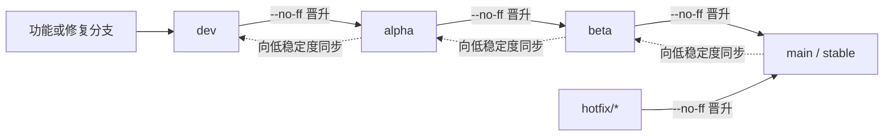

# xOyz Minecraft Launcher 发布模型

<!-- #BEGIN LANGUAGE_SWITCHER -->
**中文** (**简体**, [繁體](ReleaseSchedule_zh_Hant.md)) | [English](ReleaseSchedule.md)
<!-- #END LANGUAGE_SWITCHER -->

本文定义从 `1.0.0` 开始使用的 XYML 发布模型。

## 适用范围与历史

- `1.0.0` 是新模型下的第一个稳定版。
- 历史开发快照、标签和更新日志继续保留其原有发布模型与版本含义，不重命名，也不按新模型重新解释。
- 尚未公开发布的 `3.17.0` 稳定测试版本仅有一个严格受限的迁移例外：它可以把 `1.0.0` 稳定版识别为更新。这不是通用的版本代际或自动兼容器，也不表示允许其他 `3.x -> 1.x` 更新。
- 每段版本号都使用十进制，不使用十六进制、Base64 或其他进制。

## 版本格式

十进制数字的段数表示发布渠道。

| 渠道 | 格式 | 示例 | 测试人群 |
| --- | --- | --- | --- |
| 稳定版（Stable） | `x.y.z` | `1.0.0` | 普通用户 |
| 公测版（Beta） | `x.y.z.b` | `1.0.0.1` | 不特定、自愿参与且不预先审核的用户 |
| 内测版（Alpha） | `x.y.z.b.a` | `1.0.0.0.1` | 选定的小范围测试用户 |
| 开发版（Dev） | `x.y.z.b.a.d` | `1.0.0.0.0.1` | 开发者和早期验证人员 |

前三段表示稳定版本的变更规模：

- `x` 变化表示大型架构重构。
- `x.y` 变化表示功能更新。
- `x.y.z` 变化表示 Bug 修复或微调。

额外的 `b`、`a` 和 `d` 分别表示基于该稳定版本线的公测、内测和开发候选计数。每次晋升都要为目标渠道选择新版本号，不能仅删除末尾数字就把候选版本当作更稳定版本。

### 排序与晋升

只要在晋升时正确推进目标计数，十进制比较就能保持时间顺序。一次常规补丁候选可以按以下顺序演进：

```text
1.0.0 < 1.0.0.0.0.1 < 1.0.0.0.1 < 1.0.0.1 < 1.0.1
稳定版      开发版          内测版        公测版       稳定版
```

例如，公测版 `3.17.0.1` 通常并入稳定版 `3.17.1`，而不是稳定版 `3.17.0`。如果紧急修订已先把稳定版推进到 `3.17.1`，该候选内容可能直到稳定版 `3.17.2` 才首次合入。公测版实际晋升时，应根据其变更内容和当时的稳定版本共同决定新的稳定版本号。

## 分支模型

| 分支 | 渠道 | 职责 |
| --- | --- | --- |
| `main` | 稳定版 | 面向普通用户的发布与紧急修订 |
| `beta` | 公测版 | 由不特定的自愿用户公开测试 |
| `alpha` | 内测版 | 由选定的小范围用户测试 |
| `dev` | 开发版 | 功能和修复的默认集成分支 |

GitHub 默认分支应设为 `dev`。功能分支和修复分支从 `dev` 创建，完成针对性开发与测试后再合并回 `dev`。



所有向更稳定渠道的合并都必须使用 `git merge --no-ff`，包括 `hotfix/* -> main`。这样可以用明确的合并提交保留已经测试过的候选边界。稳定版完成紧急修订或晋升后，再按 `main -> beta -> alpha -> dev` 逐级同步。共享发布分支不得 rebase 或强制推送。

发布策略工作流会在合并前检查相邻分支流向，并在合并后审计晋升提交。仓库规则还必须允许发布 PR 使用合并提交；合并后的审计可以发现 squash 或 rebase 合并，但无法在事实发生后撤销它。

## 分发与反馈

更新频率从稳定版、公测版、内测版到开发版依次升高。

| 渠道 | GitHub 下载 | 其他下载位置 | 反馈入口 |
| --- | --- | --- | --- |
| 稳定版 | 公开 | 发布 | 公开 |
| 公测版 | 公开 | 可发布 | 公开 |
| 内测版 | 公开预发布 | 不发布 | 受限测试计划 |
| 开发版 | 公开预发布 | 不发布 | 受限测试计划 |

内测版和开发版会在 GitHub Releases 中公开提供下载。二进制文件可以公开获取，并不代表反馈入口也公开：这两个渠道只通过受限测试计划收集反馈，公开 Bug 表单只接受当前稳定版和公测版的问题。

## 构建与发布

构建接受以下发布输入：

- `RELEASE_CHANNEL`：必须是 `stable`、`beta`、`alpha` 或 `dev`。
- `RELEASE_VERSION`：晋升时使用的完整十进制版本号。
- `BUILD_NUMBER`：未指定 `RELEASE_VERSION` 时，普通 CI 构建使用的最后一段正十进制数字。
- `STABLE_VERSION`：可选，用于覆盖 `config/project.properties` 中的 `stableVersion`。

正式构建会拒绝缺失或格式错误的发布输入。本地构建默认生成六段开发快照，例如 `1.0.0.0.0.SNAPSHOT`。

GitHub 发布工作流必须从与所选渠道一致的分支运行。它会创建公开 Release，把公测版、内测版和开发版标记为预发布，并更新对应渠道的升级描述文件。只有稳定版和公测版构建会交给 GitHub 之外的分发任务。
