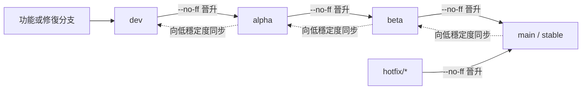

# xOyz Minecraft Launcher 發佈模型

<!-- #BEGIN LANGUAGE_SWITCHER -->
**中文** ([简体](ReleaseSchedule_zh.md), **繁體**) | [English](ReleaseSchedule.md)
<!-- #END LANGUAGE_SWITCHER -->

本文定義從 `1.0.0` 開始使用的 XYML 發佈模型。

## 適用範圍與歷史

- `1.0.0` 是新模型下的第一個穩定版。
- 歷史開發快照、標籤和更新日誌繼續保留其原有發佈模型與版本含義，不重新命名，也不按新模型重新解釋。
- 尚未公開發佈的 `3.17.0` 穩定測試版本僅有一個嚴格受限的遷移例外：它可以把 `1.0.0` 穩定版識別為更新。這不是通用的版本代際或自動相容器，也不表示允許其他 `3.x -> 1.x` 更新。
- 每段版本號都使用十進位，不使用十六進位、Base64 或其他進位。

## 版本格式

十進位數字的段數表示發佈渠道。

| 渠道 | 格式 | 範例 | 測試人群 |
| --- | --- | --- | --- |
| 穩定版（Stable） | `x.y.z` | `1.0.0` | 一般使用者 |
| 公測版（Beta） | `x.y.z.b` | `1.0.0.1` | 不特定、自願參與且不預先審核的使用者 |
| 內測版（Alpha） | `x.y.z.b.a` | `1.0.0.0.1` | 選定的小範圍測試使用者 |
| 開發版（Dev） | `x.y.z.b.a.d` | `1.0.0.0.0.1` | 開發者和早期驗證人員 |

前三段表示穩定版本的變更規模：

- `x` 變化表示大型架構重構。
- `x.y` 變化表示功能更新。
- `x.y.z` 變化表示 Bug 修復或微調。

額外的 `b`、`a` 和 `d` 分別表示基於該穩定版本線的公測、內測和開發候選計數。每次晉升都要為目標渠道選擇新版本號，不能只刪除末尾數字就把候選版本當作更穩定版本。

### 排序與晉升

只要在晉升時正確推進目標計數，十進位比較就能保持時間順序。一次常規修補候選可以按以下順序演進：

```text
1.0.0 < 1.0.0.0.0.1 < 1.0.0.0.1 < 1.0.0.1 < 1.0.1
穩定版      開發版          內測版        公測版       穩定版
```

例如，公測版 `3.17.0.1` 通常併入穩定版 `3.17.1`，而不是穩定版 `3.17.0`。如果緊急修訂已先把穩定版推進到 `3.17.1`，該候選內容可能直到穩定版 `3.17.2` 才首次合入。公測版實際晉升時，應根據其變更內容和當時的穩定版本共同決定新的穩定版本號。

將公測版晉升到 `main` 或發佈穩定版 Hotfix 的修補，必須同時把 `config/project.properties` 中的 `stableVersion` 更新為選定的穩定版本。後續按 `main -> beta -> alpha -> dev` 同步時，必須把這一穩定基線帶到所有發佈分支。

## 分支模型

| 分支 | 渠道 | 職責 |
| --- | --- | --- |
| `main` | 穩定版 | 面向一般使用者的發佈與緊急修訂 |
| `beta` | 公測版 | 由不特定的自願使用者公開測試 |
| `alpha` | 內測版 | 由選定的小範圍使用者測試 |
| `dev` | 開發版 | 功能和修復的預設整合分支 |

GitHub 預設分支應設為 `dev`。功能分支和修復分支從 `dev` 建立，完成針對性開發與測試後再合併回 `dev`。



所有向更穩定渠道的合併都必須使用 `git merge --no-ff`，包括 `hotfix/* -> main`。這樣可以用明確的合併提交保留已經測試過的候選邊界。穩定版完成緊急修訂或晉升後，再按 `main -> beta -> alpha -> dev` 逐級同步。共享發佈分支不得 rebase 或強制推送。

發佈策略工作流程會在合併前檢查相鄰分支流向，並在合併後稽核晉升提交。儲存庫規則還必須允許發佈 PR 使用合併提交；合併後的稽核可以發現 squash 或 rebase 合併，但無法在事實發生後撤銷它。

## 分發與回饋

更新頻率從穩定版、公測版、內測版到開發版依次升高。

| 渠道 | Github Release | 官網 | 回饋入口 |
| --- | --- | --- | --- |
| 穩定版 | 發佈 | 發佈 | 公開 |
| 公測版 | 不發佈 | 發佈 | 公開 |
| 內測版 | 不發佈 | 不發佈 | 受限測試計畫 |
| 開發版 | 不發佈 | 不發佈 | 受限測試計畫 |

Github Release 只發佈穩定版，官網發佈穩定版和公測版。內測版和開發版不公開分發，只透過受限測試計畫收集回饋。公開 Bug 表單只接受目前穩定版和公測版的問題。

## 建置與發佈

建置接受以下發佈輸入：

- `RELEASE_CHANNEL`：必須是 `stable`、`beta`、`alpha` 或 `dev`。
- `RELEASE_VERSION`：晉升時使用的完整十進位版本號。
- `BUILD_NUMBER`：未指定 `RELEASE_VERSION` 時，一般 CI 建置使用的最後一段正十進位數字。
- `STABLE_VERSION`：可選，用於覆寫 `config/project.properties` 中的 `stableVersion`。

根 Gradle 建置中 `stl` 分類下的任務會根據 Git 拓撲推斷版本號。渠道計數是從所選發佈提交與相鄰更穩定分支的合併基點開始，沿首父歷史計算的提交數。`buildMain`、`buildBeta`、`buildAlpha` 和 `buildDev` 會把該推斷版本注入隔離建置。

功能分支和游離提交保持六段開發版格式 `x.y.z.0.0.d`。其中 `d` 是與 `dev` 合併基點所繼承的開發版計數，加上該分叉點之後的首父提交數；未提交變更不會增加版本段。其他正式建置呼叫仍會拒絕缺失或格式錯誤的發佈輸入。

Github Release 發佈工作流程只能從 `main` 執行，只建立穩定版 Release 並更新穩定版升級描述檔，不發佈公測版、內測版或開發版。官網分發按上表執行。
